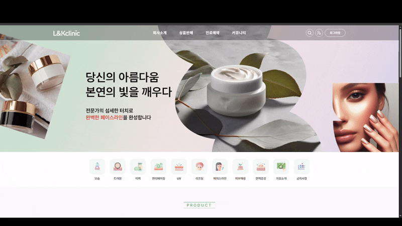
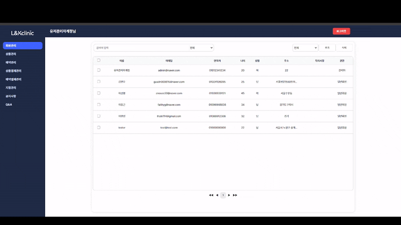
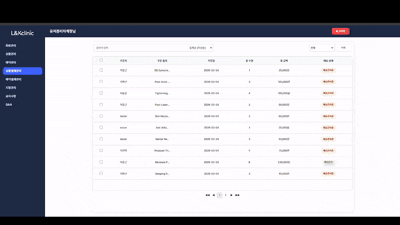
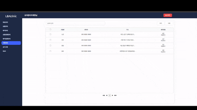
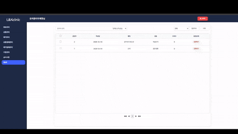

# L&K Clinic

> 뷰티 상품 구매와 시술 예약을 하나의 서비스에서 제공하는 React 기반 통합 뷰티 플랫폼

L&K Clinic은 사용자가 뷰티 상품을 구매하고 시술 상품을 예약할 수 있으며,
관리자가 회원, 상품, 예약, 결제, 지점 및 고객 문의를 통합 관리할 수 있도록 개발한 팀 프로젝트입니다.

프로젝트에서는 **라우팅 구조 설계**, **관리자 페이지 전반 설계**,
**회원·결제·지점 관리**, **공지사항·Q&A 관리**, **Kakao Map API 연동 기능**을 담당했습니다.

<br>

## 📋 프로젝트 정보

| 구분          | 내용                                 |
| ------------- | ------------------------------------ |
| 프로젝트명    | L&K Clinic                           |
| 개발 기간     | **2026.01.30 ~ 2026.03.09**          |
| 개발 인원     | 4명                                  |
| 프로젝트 형태 | React 기반 팀 프로젝트               |
| 담당 역할     | 관리자 페이지 설계 및 관리 기능 구현 |
| 기술 스택     | React, JavaScript, Redux Toolkit     |
| 외부 API      | Kakao Map API                        |
| Mock Server   | JSON Server                          |

## 🛠 기술 스택

### Front-End

<p>
  
  
  
  
</p>

### API & Tools

<p>
  
  
</p>

### Collaboration

<p>
  
  
  
</p>

## 🎬 프로젝트 미리보기

<p align="center">
  
</p>

### 서비스 소개

L&K Clinic은 **뷰티 상품 구매와 시술 예약을 하나의 플랫폼에서 제공하는 서비스**입니다.

- 사용자 : 상품 구매, 시술 예약, 장바구니, 결제, 마이페이지
- 관리자 : 회원, 상품, 예약, 결제, 지점, 공지사항, Q&A 통합 관리

## 💡 프로젝트 특징

- 💄 뷰티 상품 구매와 시술 예약을 하나의 서비스에서 제공
- 📅 날짜·시간 기반 시술 예약 기능
- 🛒 상품과 예약 상품을 하나의 장바구니에서 통합 결제
- 📍 Kakao Map API를 활용한 지점 위치 관리
- 👨‍💼 관리자 페이지에서 회원, 상품, 예약, 결제 및 지점을 통합 관리

## 👨‍💻 담당 역할

- React Router 기반 사용자·관리자 페이지 라우팅 구조 설계
- 관리자 페이지 공통 레이아웃 및 UI 구조 설계
- 검색, 필터, 페이징 등 공통 관리 컴포넌트 구현
- 회원 관리 기능 구현 (조회, 검색, 추가, 수정, 삭제)
- 상품 결제 및 예약 결제 관리 기능 구현
- 지점 관리 기능 구현 및 Kakao Map API 연동
- 공지사항 및 Q&A 관리 기능 구현
- 관리자 페이지 공통 CSS 설계
- 프로젝트 통합 테스트 및 기능 오류 수정

## ✨ 담당 기능 상세

### 📌 관리자 페이지 구조 설계

- 관리자 전용 공통 레이아웃 구성
- 사이드바 기반 메뉴 구조 설계
- React Router를 활용한 관리자 페이지 라우팅 구성
- 페이지별 공통 UI 및 CSS 구조 통일
- 검색, 필터, 전체 선택, 페이징 등 관리자 공통 기능 설계

<p align="center">
  
</p>

---

### 👤 회원 관리

- 회원 목록 조회
- 이름, 이메일 등 조건별 검색
- 회원 추가, 수정 및 삭제
- 회원 유형 및 상태별 관리

<p align="center">
  
</p>

---

### 💳 상품 결제 관리

- 상품 주문 내역 조회
- 주문 정보 및 구매 회원 확인
- 배송 준비, 배송 완료 상태 변경
- 주문 내역 수정 및 삭제

<p align="center">
  
</p>

---

### 📍 지점 관리

- 지점 목록 조회 및 등록, 수정, 삭제
- Kakao Map API를 활용한 지점 위치 표시
- 주소 입력 시 Kakao Map API를 이용하여 지도와 마커 자동 연동
- 관리자 페이지에서 변경한 지점 정보를 사용자 지점 소개 페이지에 반영

<p align="center">
  
</p>

---

### 💬 Q&A 관리

- 문의 상세 내용 확인
- 답변 상태를 `답변 대기`, `답변 완료`로 구분

<p align="center">
  
</p>

---

### 🧪 통합 테스트 및 오류 수정

- 사용자 페이지와 관리자 페이지 간 데이터 연동 검토
- 라우팅 및 상태 관리 오류 수정
- 검색, 정렬, 필터 및 페이징 기능 동작 점검
- 팀원별 작업 병합 이후 UI 충돌 및 기능 오류 수정

## 🚀 실행 방법

### 1. 프로젝트 클론

```bash
git clone https://github.com/Drag-93/project_L-K-Clinic.git
cd project_L-K-Clinic
```

### 2. 패키지 설치

```bash
npm install
```

### 3. 환경 변수 설정

프로젝트 루트에 `.env` 파일을 생성한 후 아래 내용을 입력합니다.

```env
VITE_KAKAO_MAP_KEY=본인의_카카오_JavaScript_API_KEY
```

> Kakao Developers에서 JavaScript API Key를 발급받아 입력해야 합니다.

### 4. JSON Server 실행

```bash
npx json-server --watch src/db/db.json --host 0.0.0.0 --port 3001
```

### 5. 프로젝트 실행

```bash
npm run dev
```

## 👥 팀원 구성

| 이름          | 담당 업무                                 |
| ------------- | ----------------------------------------- |
| 김현우 (팀장) | 메인, 마이페이지, 장바구니, 결제          |
| 이용근        | 관리자 페이지 구조 설계 및 관리 기능 구현 |
| 이선영        | 상품 및 예약 목록, 후기, 상품 관리        |
| 이현성        | 로그인, 회원가입, 지점 소개, 예약 관리    |
